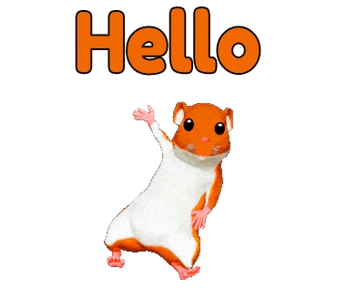
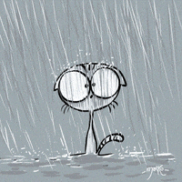

<!DOCTYPE html>
<html>
    <head>
        <title>French stuff</title>
        
    </head>
    <body>
        <marquee>
            <h1>Welcome, class!</h1>
        </marquee>
        

            <h3 id="toc_title">Table of Contents</h3>
            <ul id="toc_ul">
                <!--<li><a href="#one">One: "Expresso," or What Drinks am I Even Making?</a></li>
                <li><a href="#two">Two: "Variety is the Spice of Life," or Secondary Terms</a></li>
                <li><a href="#three">Three: "Numerology," or Coffee Cups and You</a></li>
                <li><a href="#four">Four: "Yes, Chef!" or, Making Ingredients In-House</a></li>
                <li><a href="#five">Five: "Now we're cooking with gas!" or, Drink-Making</a></li>
                <li><a href="#six">Six: "Addiction," or My Favorite Drinks</a></li>-->
            </ul>
        

        

            <h2>Greetings</h2>
            

                
                <caption class="english">"Hello!"</caption>
            

            

                
                <caption class="english">"Hi!"</caption>
            

            

                
                <caption class="english">"Hey!"</caption>
            

            

                
                <caption class="english">"What's up?"</caption>
            

        

        

            <h2>Introduction</h2>
            

                
                <caption class="english">How are you?</caption>
            

            

                
                <caption class="english">I am doing well!</caption>
            

            

                
                <caption class="english">I am not doing well.</caption>
            

            

                
                <caption class="english">What is your name?</caption>
            

            

                
                <caption class="english">My name is...</caption>
            

            

                
                <caption class="english">I like...</caption>
            

            

                
                <caption class="english">I do not like...</caption>
            

            

                
                <caption class="english">What do you like?</caption>
            

        

        

            <h2>Feelings</h2>
            

                
                <caption class="english">I am happy!</caption>
            

            

                
                <caption class="english">I am sad.</caption>
            

            

                
                <caption class="english">I am angry!</caption>
            

            

                
                <caption class="english">I am excited!</caption>
            

            

                
                <caption class="english">I am surprised!</caption>
            

        

        

            <h2>Weather</h2>
            

                
                <caption class="english">It is sunny.</caption>
            

            

                
                <caption class="english">It is raining.</caption>
            

            

                
                <caption class="english">It is windy!</caption>
            

            

                
                <caption class="english">It is hot.</caption>
            

            

                
                <caption class="english">It is cold.</caption>
            

        

    </body>
</html>
